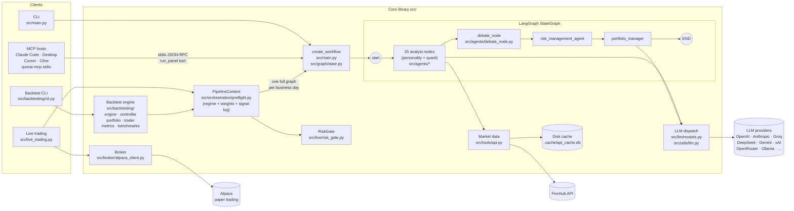

# Architecture

## Overview

Quorai is an educational proof-of-concept for an AI-driven investment system. It runs a
multi-agent pipeline in which 25 "analyst" agents (personality-based LLM investors such as Warren
Buffett, Michael Burry, Cathie Wood, etc. plus dedicated fundamental/technical/sentiment/valuation
agents) each produce a bullish/bearish/neutral signal per ticker. Those signals flow through a
debate node, then a risk manager, then a portfolio manager that emits final trading decisions.
No real trades are executed.

Two active layers:

- **`src/` — core library / CLI.** The agent graph, all analyst agents, data fetching (yfinance + Finnhub),
  disk-persisted caching, multi-provider LLM dispatch, and the backtesting engine.
- **`src/mcp_server/` — MCP server.** Exposes `run_panel`, `list_analysts`, `get_analyst_info`, and
  `run_single_analyst` as MCP tools. Installed by MCP hosts (Claude Code, Claude Desktop, Cursor, etc.)
  via `uvx quorai-mcp`. The server is a thin async wrapper around `src.main.run_quorai` — no Quorai
  core logic lives here. Uses `asyncio.Lock` to serialize concurrent panel invocations (LangGraph's
  SQLite cache is not concurrency-safe across simultaneous runs).

## Details

### Architecture diagram



---

### Entry points

| Entry point | Purpose |
|---|---|
| `src/main.py` | CLI — single run via `run_quorai()`. Parses args with `src/cli/input.py`, builds and invokes the LangGraph, prints results via `src/utils/display.py`. |
| `src/backtesting/cli.py` | Backtest CLI — subcommands: (default) single run, `compare` (A/B), `feedback` (label + score), `attribution` (per-analyst IC report), `ablation` (gate-disabled delta runs). |
| `src/mcp_server/server.py` | MCP server — `quorai-mcp` console script. Four FastMCP tools: `run_panel`, `list_analysts`, `get_analyst_info`, `run_single_analyst`. Thin async wrapper around `run_quorai()`; `asyncio.Lock` serializes concurrent panel runs. |

---

### Agent graph (LangGraph)

The graph is built in `src/main.py:create_workflow()` and uses a shared `AgentState` TypedDict
(`src/graph/state.py`) with three annotated channels: `messages` (concat), `data` (merge),
`metadata` (merge).

Topology: `start_node` fans out in parallel to every selected analyst. All analysts feed into
`debate_node`, which aggregates signals into 6 strategy groups and (optionally) applies conviction
weights. The debate output flows to `risk_management_agent`, then `portfolio_manager`, then `END`.
Regime selection and conviction-weight loading happen **engine-side** in
`src/orchestration/preflight.py:PipelineContext` before the graph is invoked.

```
start_node → [analyst_1 … analyst_25] → debate_node → risk_management_agent → portfolio_manager → END
```

**Analyst interface** (`src/agents/*.py`): each node reads `state["data"]` for tickers and dates,
fetches financial data via `src/tools/api.py`, calls the LLM via `src/utils/llm.py:call_llm()`
with a shared `BaseSignal` Pydantic schema (`src/agents/_signals.py`) containing `signal`
(bullish/bearish/neutral), `confidence` (int 0–100), and `reasoning`, and writes results to
`state["data"]["analyst_signals"][agent_id]`.

**Debate node** (`src/agents/debate_node.py`): aggregates individual analyst signals into 6
strategy groups (`deep_value`, `growth_and_catalyst`, `macro_and_cycle`, `quant_systematic`,
`quality_compounders`, `sentiment_and_analytical`). Within each group, signals are weighted by
per-agent conviction weights loaded from `src/feedback/weights.json` (when
`use_conviction_weights=True`; falls back to uniform weights). The group consensus signals are
written to `state["data"]["analyst_signals"]` and forwarded to the risk manager.

**Risk manager** (`src/agents/risk_manager.py`): pure maths — computes volatility- and
correlation-adjusted position limits. No LLM call. The per-ticker `base_limit` (default 20% of NAV)
scales with the active `--risk-profile` preset, read from `state["metadata"]["risk_profile"]`.

**Portfolio manager** (`src/agents/portfolio_manager.py`): before calling the LLM, runs
`compute_allowed_actions(tickers, …, regime, group_signals)` to deterministically filter the action
space. Three individually toggleable gates apply in sequence (set env var to `"0"` to disable):

| Gate | Env var | Default | Rule |
|---|---|---|---|
| Regime | `QUORAI_GATE_REGIME` | on | `bull_trend` → remove `short` when quant/growth bullish; `bear_trend` → remove `buy` when quant/quality bearish; `risk_off` → remove both |
| Panel-tilt | `QUORAI_GATE_PANEL` | on | Remove `buy` (tilt ≤ −0.34) or `short` (tilt ≥ +0.34) when ≥ 40% of analysts are directional |
| Min-hold | `QUORAI_GATE_MIN_HOLD` | on | Block `sell` within 2 cycles of a `buy`; block `cover` within 2 cycles of a `short` |

`cover` and `sell` are never blocked by the regime gate. Cash/margin capacity constraints are always enforced and cannot be toggled. The LLM then receives the pruned action space.

The 25 analysts from `src/utils/analysts.py:ANALYST_CONFIG` (type: "analyst"):
aswath_damodaran, ben_graham, bill_ackman, cathie_wood, charlie_munger, cliff_asness,
ed_seykota, fundamentals_analyst, growth_analyst, howard_marks, jim_simons, joel_greenblatt,
michael_burry, mohnish_pabrai, nassim_taleb, news_sentiment_analyst, peter_lynch, phil_fisher,
rakesh_jhunjhunwala, ray_dalio, sentiment_analyst, stanley_druckenmiller, technical_analyst,
valuation_analyst, warren_buffett.

---

### Data layer

**Providers** (dual-source):
- **yfinance** (`src/tools/_yfinance_fundamentals.py`) — prices, financial metrics, financial
  line items, market cap. No API key required.
- **Finnhub** (`src/tools/api.py`, `FINNHUB_BASE_URL`) — insider trades and company news.
  `FINNHUB_API_KEY` env var required; rate-limit backoff on HTTP 429 in `_make_api_request`.

**Functions**: `get_prices`, `get_financial_metrics`, `search_line_items`, `get_insider_trades`,
`get_company_news`, `get_market_cap`, `get_price_data` (convenience, returns a DataFrame).

**Cache** (`src/data/cache.py`): thread-safe, SQLite-backed disk persistence at
`.cache/api_cache.db` (atomic write via tmp + replace). Six per-ticker caches keyed on time
fields; a global singleton retrieved via `get_cache()`.

**SEC fundamentals store** (`src/data/sec_store.py`): read-on-demand SQLite store at
`.cache/sec_fundamentals.db` seeded by `experiments/seed_sec_fundamentals.py`. Stores
point-in-time XBRL Company Facts from SEC EDGAR and exposes:
- `SecStore.get_statements(ticker, end_date, periodicity)` — returns annual / quarterly / TTM
  financial statements accurate as of `end_date` (no look-ahead bias).
- `SecStore.get_shares_outstanding(ticker, end_date)` — returns shares outstanding as of
  `end_date`; fixes the yfinance `.info` look-ahead bug where current share counts appear in
  historical queries.

TTM is computed by summing the trailing four reported quarters; per-share items are treated as
instantaneous (most-recent-quarter value). When a Q4 filing is missing, Q4 is derived as
`FY − Q1 − Q2 − Q3`. `fetch_statements()` and `fetch_market_cap()` in
`src/tools/_yfinance_fundamentals.py` consult `SecStore` first and fall through to yfinance only
when a ticker is not yet seeded. Seed with:

```bash
QUORAI_SEC_USER_AGENT="your.email@example.com" \
  uv run python experiments/seed_sec_fundamentals.py --tickers AAPL,MSFT
```

**Models** (`src/data/models.py`): Pydantic models — `Price`, `FinancialMetrics` (40+ ratio fields),
`LineItem` (`extra="allow"` for dynamic XBRL fields), `InsiderTrade`, `CompanyNews`.

---

### LLM layer

`src/llm/models.py` defines a `ModelProvider` enum with **14 providers**:
Alibaba, Anthropic, Azure OpenAI, DeepSeek, GigaChat, Google, Groq, Kimi, Local (Ollama), Meta,
Mistral, OpenAI, OpenRouter, xAI. The catalog is loaded from `src/llm/api_models.json`.
`LOCAL` uses `langchain_ollama.ChatOllama` and requires a running Ollama daemon.

`get_model()` (`src/llm/models.py:122`) returns the appropriate LangChain chat client.
OpenRouter and Kimi reuse `ChatOpenAI` with a custom `base_url`.

`src/llm/request.py:RunRequest` is a dataclass that carries per-run overrides through the agent graph via `state["metadata"]["request"]`. It holds two things: `api_keys` (dict of provider → key, used to hot-swap keys without touching `.env`) and `agent_models` (dict of `agent_id` → `(model_name, provider)` tuples, populated from `--agent-model AGENT=model/PROVIDER` CLI flags or the `QUORAI_AGENT_MODELS_JSON` env var). `RunRequest.get_agent_model_config(agent_name)` resolves a per-agent override or falls back to the wildcard `"*"` entry. `BacktestEngine` and `LiveRunner` both construct a `RunRequest` during preflight and inject it into initial graph state.

`src/utils/llm.py:call_llm()` is the structured-output helper:
- Uses `.with_structured_output(pydantic_model, method="json_mode")` for JSON-mode-capable models.
- For DeepSeek/Gemini, falls back to `extract_json_from_response()` (parses a `` ```json `` block).
- Retries up to 3 times; falls back to a safe neutral default on failure.
- Supports per-agent model overrides via `state["metadata"]["request"]`.

---

### Backtesting engine

`src/backtesting/engine.py:BacktestEngine` is the core loop:

1. `_prefetch_data()` — pre-pulls 1 year of prices, metrics, insider trades, news, and SPY.
2. For each business day (`pd.date_range(..., freq="B")`), delegates to
   `PipelineContext.run_cycle()` (`src/orchestration/preflight.py`), which:
   - Optionally classifies the SPY market regime (`src/regime/classifier.py`) and narrows
     the active analyst list via `src/regime/policy.py` (when `use_regime_selection=True`).
   - Invokes the full agent graph via `AgentController.run_agent()` (`controller.py`).
   - Logs per-agent-per-ticker signals and accumulates token usage.
   - Uses **next-day open** as the fill price to avoid lookahead bias.
   - Executes trades via `TradeExecutor` (`trader.py`) → `Portfolio` (`portfolio.py`).
   - Logs per-agent-per-ticker signals to JSONL via `SignalLogger` (`signal_log.py`).
   - Accumulates per-agent LLM token counts from `AgentOutput.token_usage`.
   - Computes mark-to-market value via `src/backtesting/valuation.py`.
   - Recomputes metrics (Sharpe, Sortino, max drawdown) via `metrics.py` after ≥3 data points.
3. Benchmarks against SPY (`benchmarks.py`).

`BacktestEngine` kwargs that activate optional subsystems:
- `use_regime_selection: bool = False` — daily SPY regime gate (see **Regime selection** below).
- `use_conviction_weights: bool = False` — load `weights.json` into debate aggregation (see **Conviction-weight feedback loop** below).
- `cost_model: CostModel | None = None` — see **Trading cost model** below.

The engine treats `run_quorai` as a black box — the entire graph is rebuilt and invoked once
per simulated day.

**Performance metrics** (returned by `engine.get_metrics()` and printed in ENGINE RUN COMPLETE):
Sharpe, Sortino, max drawdown, total return, SPY benchmark return, alpha vs SPY (strategy − SPY
cumulative return), alpha vs equal-weight ticker basket, and information ratio vs SPY
(`√252 × mean(active_daily_return) / std(active_daily_return)`).

**Log layout**: backtest artifacts land in `logs/backtest/{cycles,runs,signals}/`, separate from
live logs in `logs/cycles/` and `logs/runs/`. The `run_id` is prefixed with the execution date and
a config fingerprint (`YYYY-MM-DD-<hash>`) so runs never overwrite each other. Override the root
directory with `--log-dir`; tag the run with `--run-label` (embedded in `run_id` and the manifest).

**Evaluation harness** (`experiments/run_scenarios.py`): sweeps 10 curated period × ticker-set
scenarios spanning BULL/BEAR/RISK_OFF/NEUTRAL regimes, streams subprocess output live, collects
run manifests, classifies each window's regime via `classify_regime`, and writes a markdown summary
to `experiments/results/eval-<date>.md`. Supports `--max-tickers` / `--max-days` smoke-test
truncation and `--no-regime-selection` / `--no-conviction-weights` toggles.

---

### Regime selection

`src/regime/classifier.py:classify_regime()` takes the prefetched SPY DataFrame and a date,
and returns a `MarketRegime` enum value using three indicators:

| Indicator | Window |
|---|---|
| SMA trend | 20-day SMA |
| Short-term vol | 20-day daily-return std |
| Long-run vol | 60-day daily-return std |
| Drawdown from peak | Rolling 60-day max |

Rules applied in order:
1. **RISK_OFF** — drawdown > 8% below peak AND short-vol > 1.5× long-vol
2. **BULL_TREND** — close > SMA and vol ratio ≤ 1.5
3. **BEAR_TREND** — close < SMA and vol ratio > 1.0
4. **NEUTRAL** — otherwise (also used when insufficient history)

`src/regime/policy.py:select_analysts_for_regime()` maps each regime to a subset of strategy
groups:

| Regime | Active groups |
|---|---|
| BULL_TREND | growth_and_catalyst, quant_systematic, quality_compounders, sentiment_and_analytical |
| BEAR_TREND | deep_value, macro_and_cycle, quality_compounders, sentiment_and_analytical |
| RISK_OFF | macro_and_cycle, deep_value, sentiment_and_analytical |
| NEUTRAL | all groups |

The engine calls this per day; the narrowed analyst list replaces `selected_analysts` for
that bar's graph invocation.

---

### Conviction-weight feedback loop

The feedback pipeline runs as a post-processing step after a backtest completes:

```
BacktestEngine (signal_log.py JSONL sink)
  → feedback/labeler.py  (attach 1d / 5d / 20d forward returns)
  → feedback/scorer.py   (rolling per-agent hit-rate → weights.json + accuracy_report.json)
  → feedback/loader.py   (load_weights() → {} if missing)
  → debate_node._aggregate_to_groups()  (weight analyst votes by loaded weights)
```

**`src/backtesting/signal_log.py:SignalLogger`** — opened at engine start, appends one JSONL
record per agent+ticker per day: `{date, agent_id, ticker, signal, confidence, price_at_signal}`.

**`src/feedback/labeler.py:label_signals()`** — reads the JSONL, joins with prefetched prices,
and writes a labeled JSONL with `return_1d`, `return_5d`, `return_20d` columns.

**`src/feedback/scorer.py:compute_weights()`** — reads the labeled JSONL, computes rolling
hit-rates over the most recent 60 trading-day window per agent (min 5 samples), normalises
weights to mean = 1.0, writes `weights.json` and `accuracy_report.json`.

**`src/feedback/loader.py:load_weights()`** — reads `weights.json`; returns `{}` if missing
(causing the debate node to fall back to uniform weights).

**`src/agents/debate_node.py:_aggregate_to_groups()`** — applies weights when
`use_conviction_weights=True`. Analyst votes within each strategy group are multiplied by their
weight before being summed into a group consensus signal.

---

### Token telemetry

`src/utils/llm.py:call_llm()` captures `LLMResult.usage_metadata` (or `AIMessage.usage_metadata`)
after every structured-output call and stores `{input_tokens, output_tokens, total_tokens}` on
the returned `AgentOutput`.

`src/backtesting/controller.py:AgentController.run_agent()` accumulates per-agent token counts
into a `token_usage` dict that is returned as part of each day's result.

`BacktestEngine` aggregates token totals across the full run and exposes them in the final metrics
dict (`get_metrics()`) under key `"token_usage"`.

`src/utils/llm.py:_attach_cache_control()` (line 84) injects `cache_control: {"type": "ephemeral"}` onto the system-prompt block for Anthropic-routed models before each invocation. Cache activity is captured in `TokenCapture` alongside standard counts: `cache_read_input_tokens` (tokens served from cache) and `cache_creation_input_tokens` (tokens written to cache) are stored as `cache_read_tokens` / `cache_creation_tokens` on `AgentOutput` and accumulated into the `token_usage` summary dict.

---

### Per-ticker parallelism

`src/utils/concurrency.py:parallel_per_ticker()` accepts a list of ticker keys and a callable, and executes them concurrently using a `ThreadPoolExecutor`. The pool size is read from the `QUORAI_PARALLEL_TICKERS` environment variable (integer, default 1 — i.e. sequential). Setting it to a value greater than 1 is useful when running against many tickers and the bottleneck is LLM latency rather than CPU.

Both `BacktestEngine` (one `run_quorai` call per ticker per day) and `LiveRunner` can use this to parallelise the per-ticker graph invocations within a single trading cycle.

---

### Trading cost model

`src/backtesting/costs.py:CostModel` is a frozen dataclass that parameterises three components
of trading friction — all default to **zero** so existing tests and frictionless runs are unaffected:

| Field | Meaning | Recommended (liquid US equities) |
|---|---|---|
| `slippage_bps` | Per-side price impact. Buys/covers fill at `price × (1 + bps/1e4)`; sells/short-opens at `price × (1 - bps/1e4)`. | 5 |
| `commission_bps` | Per-trade commission on notional, debited from cash separately (cost-basis stays at execution price). | 2 |
| `borrow_bps_annual` | Annualised short-borrow carry, accrued daily (`÷ 252`) on open short notional via `Portfolio.accrue_borrow_cost()`. | 50 |

Because costs are charged to `Portfolio.cash`, they propagate through NAV → the equity curve →
Sharpe/Sortino/maxDD/alpha in `metrics.py` automatically — no metrics rewrite was needed.

Costs are exposed in `BacktestEngine.get_cost_summary()` and printed as a `TRADING COSTS` block in
the CLI when any component is non-zero.  The three cost parameters are also forwarded through `RunConfig`
so A/B and ablation runs can vary friction levels.

Enable via CLI flags: `--slippage-bps`, `--commission-bps`, `--borrow-bps-annual`.

---

### Comparison harness

`src/backtesting/comparison.py:run_comparison()` accepts a list of `RunConfig` dataclasses
(same fields as `BacktestEngine` kwargs plus a `label: str`), runs each config sequentially,
and prints a side-by-side table of:
- Total return, Sharpe, Sortino, max drawdown
- Total LLM tokens consumed, total trading costs

The `compare` subcommand (`python -m src.backtesting compare`) accepts two preset comparisons:
- `--mode regime` — Full analyst set vs regime-selected subset
- `--mode weights` — Uniform analyst weights vs conviction weights
- `--mode both` — Both comparisons sequentially

`run_ablation()` (the `ablation` subcommand) runs a baseline plus one config per disabled PM gate
(`QUORAI_GATE_REGIME=0`, `QUORAI_GATE_PANEL=0`, `QUORAI_GATE_MIN_HOLD=0`), then prints a delta
table (return/Sharpe/costs vs baseline).  Cost flags are forwarded so churn deltas are friction-adjusted.

---

### Alpha attribution

`src/backtesting/attribution.py:compute_attribution(labeled_signal_log, horizon)` reads the labeled
JSONL produced by `feedback/labeler.py` and emits a per-analyst report with:

| Metric | Definition |
|---|---|
| `hit_rate` | Fraction of directional signals whose sign matched the forward return |
| `directional_spread` | Mean forward return when bullish − mean when bearish (crude signal IC) |
| `conf_weighted_score` | Confidence-weighted mean sign-adjusted return |
| `alpha_vs_baseline` | Mean return minus the cross-section mean |

Group-level roll-ups (summing all signals from analysts in each of the 6 strategy groups) are appended.
Output is sorted by `directional_spread` descending and written to JSON.

Run via the `attribution` subcommand after labeling a signal log with `feedback`.

---

### Persistence

- **Data cache**: SQLite at `.cache/api_cache.db` (managed by `src/data/cache.py`; thread-safe atomic writes via tmp + replace).
- **SEC fundamentals cache**: SQLite at `.cache/sec_fundamentals.db` (seeded by `experiments/seed_sec_fundamentals.py`; exposes point-in-time XBRL data via `src/data/sec_store.py`).

---

### Deployment

| Mode | How |
|---|---|
| CLI | `uv run python src/main.py --tickers AAPL,MSFT` |
| Backtest | `uv run python -m src.backtesting --tickers AAPL,MSFT --model <model>` |
| MCP server (PyPI) | `uvx quorai-mcp` — installed by MCP hosts via `claude mcp add quorai uvx quorai-mcp` |
| MCP server (local dev) | `uv run quorai-mcp` — runs the server from a local checkout |

---

### Live trading layer

`src/live_trading.py` is the entry point for paper/live trading via Alpaca.

```
AlpacaClient → PortfolioAdapter → PipelineContext.run_cycle() → LiveExecutor
                                          ↓                              ↓
                                    (regime + weights                 RiskGate
                                     + signal log)                       ↓
                                                                   AuditJournal → logs/trades-YYYY-MM-DD.jsonl
```

`LiveRunner.prepare()` runs the full pre-trade pipeline:

1. Syncs portfolio from Alpaca.
2. Builds `PipelineContext` (`src/orchestration/preflight.py`), which loads conviction weights,
   opens a `SignalLogger`, and wraps the `AgentController`.
3. Calls `PipelineContext.run_cycle()` which resolves the market regime (when
   `--use-regime-selection`), narrows the analyst list, and runs the agent graph.
4. Closes the signal logger; stores token-usage stats for console/Telegram output.

The live signal log feeds the same `feedback/labeler.py → scorer.py → weights.json` pipeline used by backtests, so conviction weights accumulate over time from live runs.

| Module | Purpose |
|---|---|
| `src/broker/__init__.py` | `Broker` Protocol — interface for any brokerage adapter |
| `src/broker/alpaca_client.py` | Alpaca Trading API wrapper (paper-only safety guard) |
| `src/broker/portfolio_adapter.py` | Converts Alpaca positions → `PortfolioSnapshot` |
| `src/live/executor.py` | `LiveExecutor` — submits orders, enforces risk gate, journals trades |
| `src/live/runner.py` | `LiveRunner` — orchestrates one live trading cycle; wires regime, weights, signal log, token telemetry |
| `src/live/risk_gate.py` | `RiskGate` — daily loss limit check |
| `src/live/audit_journal.py` | `AuditJournal` — appends JSON-L trade records |
| `src/live/sod_equity.py` | Persists start-of-day equity for daily loss calculation |
| `src/live_trading.py` | CLI entry point — `uv run python src/live_trading.py` |
| `src/config.py` | `Settings` (pydantic-settings) — centralised env-var config |
| `src/risk_profiles.py` | Five named risk presets (`conservative` → `speculative`) + `get_profile()` lookup |

`LiveRunner` CLI flags for the new subsystems:

| Flag | Default | Effect |
|---|---|---|
| `--use-regime-selection` | off | Narrow analysts to regime-appropriate groups via SPY classification |
| `--use-conviction-weights` | off | Apply per-agent weights from `src/feedback/weights.json` |
| `--no-signal-log` | (log on) | Suppress writing `logs/live/signals/signals-YYYY-MM-DD-live.jsonl` |
| `--risk-profile` | `balanced` | Risk preset — sets position-sizing `base_limit` and `RiskGate` caps. Options: `conservative`, `cautious`, `balanced`, `aggressive`, `speculative`. Defined in `src/risk_profiles.py`. |

