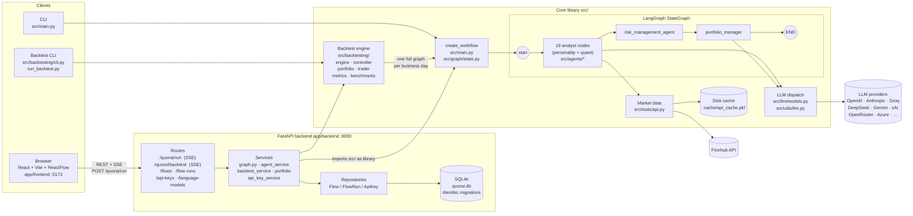

# Architecture

## Overview

Quorai is an educational proof-of-concept for an AI-driven investment system. It runs a
multi-agent pipeline in which 19 "analyst" agents (personality-based LLM investors such as Warren
Buffett, Michael Burry, Cathie Wood, etc. plus dedicated fundamental/technical/sentiment/valuation
agents) each produce a bullish/bearish/neutral signal per ticker. Those signals flow into a risk
manager and then a portfolio manager that emits final trading decisions. No real trades are executed.

The repo has three layers:

- **`src/` — core library / CLI.** The agent graph, all analyst agents, data fetching (Finnhub),
  disk-persisted caching, multi-provider LLM dispatch, and the backtesting engine. This code is
  also reused as a library by the web backend.
- **`app/` — web application.** A FastAPI backend and a React + ReactFlow frontend. The backend
  builds a LangGraph `StateGraph` from the canvas the user draws and streams execution progress
  to the browser over Server-Sent Events (SSE).
- **`v2/` — research module (mostly stubs).** A planned ground-up quant rebuild. Nearly all
  modules are docstring scaffolding; the only runnable code is `v2/signals/trivial.py` (a
  zero-signal placeholder) and the supporting `BaseSignal` ABC + registry.

## Details

### Architecture diagram



---

### Entry points

| Entry point | Purpose |
|---|---|
| `src/main.py` | CLI — single run via `run_quorai()`. Parses args with `src/cli/input.py`, builds and invokes the LangGraph, prints results via `src/utils/display.py`. |
| `src/backtesting/cli.py` | Modular backtest CLI — minimal terminal output. |
| `run_backtest.py` | Standalone script with hardcoded tickers/dates/analysts. |

---

### Agent graph (LangGraph)

The graph is built in `src/main.py:create_workflow()` and uses a shared `AgentState` TypedDict
(`src/graph/state.py`) with three annotated channels: `messages` (concat), `data` (merge),
`metadata` (merge).

Topology: a synthetic `start_node` fans out in parallel to every selected analyst.
All analysts feed into `risk_management_agent`, which edges to `portfolio_manager`, which edges to `END`.

```
start_node → [analyst_1 … analyst_19] → risk_management_agent → portfolio_manager → END
```

**Analyst interface** (`src/agents/*.py`): each node reads `state["data"]` for tickers and dates,
fetches financial data via `src/tools/api.py`, calls the LLM via `src/utils/llm.py:call_llm()`
with a Pydantic signal schema (e.g., `WarrenBuffettSignal`) containing `signal`, `confidence`,
`reasoning`, and writes results to `state["data"]["analyst_signals"][agent_id]`.

**Risk manager** (`src/agents/risk_manager.py`): pure maths — computes volatility- and
correlation-adjusted position limits. No LLM call.

**Portfolio manager** (`src/agents/portfolio_manager.py`): aggregates all analyst signals, reads
risk limits, calls the LLM to produce `{action, quantity, confidence, reasoning}` decisions.

The 19 analysts from `src/utils/analysts.py:ANALYST_CONFIG`:
aswath_damodaran, ben_graham, bill_ackman, cathie_wood, charlie_munger, michael_burry,
mohnish_pabrai, nassim_taleb, peter_lynch, phil_fisher, rakesh_jhunjhunwala,
stanley_druckenmiller, warren_buffett, technical_analyst, fundamentals_analyst,
growth_analyst, news_sentiment_analyst, sentiment_analyst, valuation_analyst.

---

### Data layer

**Provider**: Finnhub only (`src/tools/api.py:28`, `FINNHUB_BASE_URL`). Maps internal field names
to US-GAAP XBRL concepts for Finnhub's `financials-reported` endpoint.

**Functions**: `get_prices`, `get_financial_metrics`, `search_line_items`, `get_insider_trades`,
`get_company_news`, `get_market_cap`. Rate-limit backoff on HTTP 429 in `_make_api_request`.

**Cache** (`src/data/cache.py`): thread-safe, pickle-backed disk persistence at
`.cache/api_cache.pkl` (atomic write via tmp + replace). Six per-ticker caches keyed on time
fields; a global singleton retrieved via `get_cache()`.

**Models** (`src/data/models.py`): Pydantic models — `Price`, `FinancialMetrics` (40+ ratio fields),
`LineItem` (`extra="allow"` for dynamic XBRL fields), `InsiderTrade`, `CompanyNews`.

---

### LLM layer

`src/llm/models.py` defines a `ModelProvider` enum with **13 providers**:
Alibaba, Anthropic, Azure OpenAI, DeepSeek, GigaChat, Google, Groq, Kimi, Meta, Mistral,
OpenAI, OpenRouter, xAI. The catalog is loaded from `src/llm/api_models.json`.

`get_model()` (`src/llm/models.py:122`) returns the appropriate LangChain chat client.
OpenRouter and Kimi reuse `ChatOpenAI` with a custom `base_url`.

`src/utils/llm.py:call_llm()` is the structured-output helper:
- Uses `.with_structured_output(pydantic_model, method="json_mode")` for JSON-mode-capable models.
- For DeepSeek/Gemini, falls back to `extract_json_from_response()` (parses a `` ```json `` block).
- Retries up to 3 times; falls back to a safe neutral default on failure.
- Supports per-agent model overrides via `state["metadata"]["request"]`.

---

### Backtesting engine

`src/backtesting/engine.py:BacktestEngine` is the core loop:

1. `_prefetch_data()` — pre-pulls 1 year of prices, metrics, insider trades, news, and SPY.
2. For each business day (`pd.date_range(..., freq="B")`):
   - Invokes the full agent graph via `AgentController.run_agent()` (`controller.py`).
   - Uses **next-day open** as the fill price to avoid lookahead bias.
   - Executes trades via `TradeExecutor` (`trader.py`) → `Portfolio` (`portfolio.py`).
   - Computes mark-to-market value via `src/backtesting/valuation.py`.
   - Recomputes metrics (Sharpe, Sortino, max drawdown) via `metrics.py` after ≥3 data points.
3. Benchmarks against SPY (`benchmarks.py`).

The engine treats `run_quorai` as a black box — the entire graph is rebuilt and invoked once
per simulated day.

---

### Web backend (`app/backend`)

**Framework**: FastAPI, launched on `:8000`.

**Key routes** (`app/backend/routes/`):

| Route | Description |
|---|---|
| `POST /quorai/run` | SSE stream — builds LangGraph from posted canvas, runs it in a background executor, yields `start / progress / complete / error` events. |
| `POST /quorai/backtest` | SSE stream — runs `BacktestService`, yields per-day results. |
| `GET /quorai/agents` | Returns available analyst configs. |
| `/flows`, `/flows/{id}/runs` | CRUD for saved React Flow canvases and their run history. |
| `/api-keys` | CRUD for provider API keys (stored encrypted-at-rest in SQLite). |
| `/language-models` | Proxies `src.llm.models.get_models_list()`. |

**Services** (`app/backend/services/`):
- `graph.py` — `create_graph()` builds a `StateGraph` from the canvas nodes/edges posted by the
  frontend, wiring `portfolio_manager` and `risk_management`. Imports directly from `src.agents.*`.
- `agent_service.py` — `create_agent_function` uses `functools.partial` to bind `agent_id`.
- `portfolio.py` — builds the portfolio dict expected by the agent graph.
- `backtest_service.py` — iterates trading days, calls `run_graph_async` per day.
- `api_key_service.py` — loads active keys from DB to hydrate `request_data.api_keys`.

Progress is delivered from `src/` to the SSE route via a pub/sub bus in `src/utils/progress.py`.

---

### Frontend (`app/frontend`)

**Stack**: React 18 + Vite 5 + TypeScript + `@xyflow/react` (ReactFlow v12) + Tailwind + Radix UI.

The canvas (`app/frontend/src/components/Flow.tsx`) lets the user drag analyst nodes and connect
them to a portfolio manager node. On "Run", the frontend serialises the canvas into
`{nodes, edges}` and POST-streams `/quorai/run` via `fetch` + `ReadableStream.getReader()`,
parsing `event:`/`data:` SSE frames. Node status (IDLE / IN_PROGRESS / COMPLETE / ERROR) is
updated in real time as each analyst completes.

Backend base URL: `import.meta.env.VITE_API_URL || 'http://localhost:8000'`.

---

### Persistence

- **Database**: SQLite (`app/backend/quorai.db`), SQLAlchemy + Alembic migrations under
  `app/backend/alembic/versions/`.
- **Tables**: `quorai_flows` (canvas JSON), `quorai_flow_runs` (run metadata, results),
  `quorai_flow_run_cycles` (per-day analyst signals, trades, portfolio snapshots),
  `api_keys` (provider key storage).
- **Data cache**: pickle file at `.cache/api_cache.pkl` (managed by `src/data/cache.py`).

---

### Deployment

| Mode | How |
|---|---|
| CLI | `uv run python src/main.py --ticker AAPL,MSFT` |
| Backtest | `uv run python run_backtest.py` |
| GitHub Pages | Static site at `docs/` — three tabs: Agents gallery, Trading Flow diagram, About |
| Docker | Planned — not yet present in the repository |

The static site (`docs/`) is built by `scripts/build_site.py`, which generates `docs/agents.json`
and `docs/flow.json` from `ANALYST_CONFIG` in `src/utils/analysts.py`. The three-tab layout
(`index.html` + `app.js` + `style.css`) is fully static — no build step required for the HTML/JS/CSS.

---

### Live trading layer

`src/live_trading.py` is the entry point for paper/live trading via Alpaca.

```
AlpacaClient → PortfolioAdapter → AgentController → LiveExecutor
                                                         ↓
                                                     RiskGate
                                                         ↓
                                                     AuditJournal → logs/trades-YYYY-MM-DD.jsonl
```

| Module | Purpose |
|---|---|
| `src/broker/__init__.py` | `Broker` Protocol — interface for any brokerage adapter |
| `src/broker/alpaca_client.py` | Alpaca Trading API wrapper (paper-only safety guard) |
| `src/broker/portfolio_adapter.py` | Converts Alpaca positions → `PortfolioSnapshot` |
| `src/live/executor.py` | `LiveExecutor` — submits orders, enforces risk gate, journals trades |
| `src/live/runner.py` | `LiveRunner` — orchestrates one live trading cycle |
| `src/live/risk_gate.py` | `RiskGate` — daily loss limit check |
| `src/live/audit_journal.py` | `AuditJournal` — appends JSON-L trade records |
| `src/live/sod_equity.py` | Persists start-of-day equity for daily loss calculation |
| `src/live_trading.py` | CLI entry point — `uv run python src/live_trading.py` |
| `src/config.py` | `Settings` (pydantic-settings) — centralised env-var config |

> **Docker**: Docker support (`docker/docker-compose.yml`) is planned but not yet present in this repository.

---

### v2 research module

`v2/` is an aspirational ground-up quant rebuild ("methodology over personality"). It is
**≈95% empty scaffolding**. Planned modules (`data`, `event_study`, `features`, `validation`,
`backtesting`, `portfolio`, `risk`, `pipeline`) contain only docstring stubs.

Live code:

- `v2/signals/base.py` — `BaseSignal` ABC and `SIGNAL_REGISTRY` dict.
- `v2/signals/trivial.py` — `TrivialSignal(BaseSignal)` always returns 0.0; used to validate
  the signal pipeline contract.
- `v2/models.py` — Pydantic schemas: `SignalResult`, `QuantSignals`, `PortfolioTarget`,
  `TradeOrder`, `ExecutionResult`.
- `v2/run_signal.py` — standalone signal runner (`python v2/run_signal.py --signal trivial
  --ticker AAPL --date 2026-02-28`).

`v2/` is not referenced by `src/` or `app/`.
