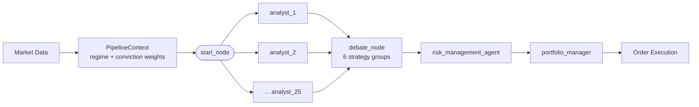
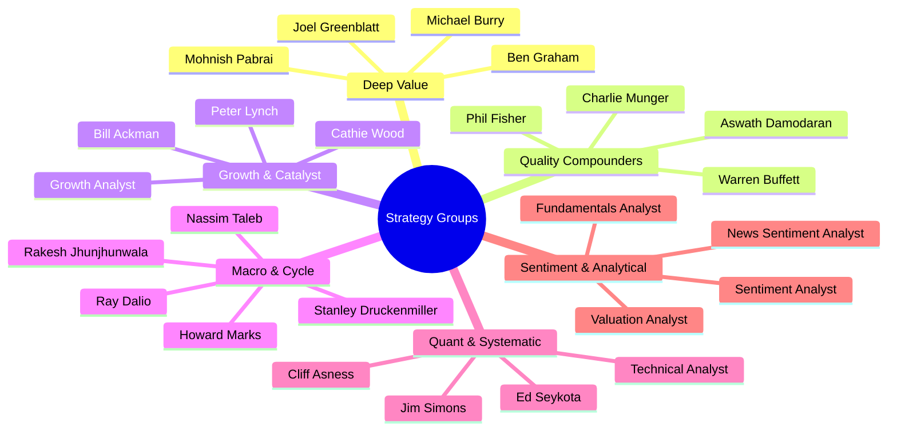

# Quorai

<p align="center">
  
</p>

*A quorum of AI agents deliberating trading decisions. Pronounced "KWOR-eye" (quorum + AI).*

**[GitHub](https://github.com/quorai/quorai)** · **[About](https://quorai.github.io/)** · **[UI](https://github.com/quorai/quorai-ui)**

[](https://www.python.org/)
[](LICENSE)
[](https://github.com/langchain-ai/langgraph)
[](https://github.com/quorai/quorai/actions/workflows/ci.yml)

A multi-agent AI trading system where specialized LLM analyst agents deliberate and vote on trading decisions through a portfolio manager. Built on [LangGraph](https://github.com/langchain-ai/langgraph) and [LangChain](https://github.com/langchain-ai/langchain). For **educational purposes only** — not intended for real trading or investment.

## Quickstart

**Prerequisites:** Python 3.11+ and [`uv`](https://docs.astral.sh/uv/getting-started/installation/).

```bash
# Install uv (skip if already installed)
curl -LsSf https://astral.sh/uv/install.sh | sh
```

**1. Clone and install**

```bash
git clone https://github.com/quorai/quorai-app.git
cd quorai-app
uv sync
```

**2. Set API keys — you need exactly two**

```bash
cp .env.example .env
```

Edit `.env` and fill in:

| Variable | Where to get it | Cost |
|---|---|---|
| `FINNHUB_API_KEY` | [finnhub.io/dashboard](https://finnhub.io/dashboard) | Free tier |
| One LLM key (pick any) | [OpenRouter](https://openrouter.ai/) `OPENROUTER_API_KEY` · [Groq](https://console.groq.com/) `GROQ_API_KEY` · [DeepSeek](https://platform.deepseek.com/) `DEEPSEEK_API_KEY` · [Anthropic](https://console.anthropic.com/) `ANTHROPIC_API_KEY` | Varies |

All other keys in `.env.example` are optional.

**3. Run your first backtest**

```bash
uv run backtester \
    --tickers AAPL,MSFT \
    --model deepseek/deepseek-chat \
    --model-provider OpenRouter \
    --show-reasoning
```

Expect **~1–3 min per simulated trading day**. The output includes per-analyst signals, debate summaries, portfolio decisions, and performance metrics (Sharpe, alpha vs SPY).

For all flags see [Usage — Backtesting](#backtesting). For the MCP server (run analysts from Claude Code/Desktop/Cursor) see [MCP server](#mcp-server).

> **Model choice matters.** All agents produce structured JSON output and the portfolio manager calls tools via LangChain. Use a model with strong instruction-following: Claude (Anthropic), GPT-4o (OpenAI), Gemini 2.5 Flash/Pro (Google), or DeepSeek Chat. Weaker models may produce malformed JSON that causes agent failures.

## Contents

- [Features](#features)
- [How it works](#how-it-works)
- [Analyst roster](#analyst-roster)
- [Architecture](#architecture)
- [Setup](#setup)
- [MCP server](#mcp-server)
- [Usage](#usage)
  - [Backtesting](#backtesting)
  - [Live / Paper Trading](#live--paper-trading)
  - [Telegram approval gate](#telegram-approval-gate)
  - [Experiments](#experiments)
- [Safety mechanisms](#safety-mechanisms)
- [Running tests](#running-tests)
- [Troubleshooting](#troubleshooting)
- [Python version](#python-version)
- [Changelog](#changelog)
- [Disclaimer](#disclaimer)
- [Acknowledgements](#acknowledgements)
- [Companion projects](#companion-projects)
- [License](#license)

## Features

- **25 analyst agents** — value, growth, macro, technical, fundamentals, sentiment, risk, and more
- **Famous investor personas** — simulations of Buffett, Munger, Ackman, Burry, Wood, Dalio, Simons, Lynch, and others
- **14 LLM providers** — OpenAI, Anthropic, Groq, Gemini, DeepSeek, xAI, OpenRouter, Ollama (local), Alibaba, Azure OpenAI, GigaChat, Meta, Mistral, Kimi
- **Backtesting engine** — replay historical data with full agent deliberation and portfolio metrics
- **Live / paper trading** — execute via Alpaca with optional Telegram approval gate
- **Group-level debate node** — collapses 25 analyst signals into 6 strategy groups via confidence-weighted aggregation; an LLM moderator summarises contested tickers
- **Market-regime selection** — classifies the current SPY regime (bull/bear/risk-off/neutral) each day and narrows the active analyst subset accordingly
- **Conviction-weight feedback loop** — tracks each agent's rolling directional hit-rate; high-accuracy agents receive proportionally more weight in the debate aggregation
- **Signal logging + forward-return labeling** — persists every per-agent-per-ticker signal to JSONL during a backtest run; a separate labeler attaches 1d/5d/20d forward returns so hit-rates can be computed
- **Token-usage telemetry** — captures and accumulates LLM token counts per agent across the full backtest run; Anthropic prompt caching is applied automatically and cache-read/creation tokens are surfaced separately
- **A/B comparison harness** — runs two backtest configs back-to-back and prints a side-by-side metrics table (full-vs-regime analysts, uniform-vs-conviction weights)
- **Per-agent model routing** — override model and provider per analyst via `--agent-model AGENT=model/PROVIDER`; handled by `RunRequest` (`src/llm/request.py`)
- **Parallel per-ticker execution** — set `QUORAI_PARALLEL_TICKERS=N` to run N tickers concurrently via a thread pool (`src/utils/concurrency.py`)
- **SEC EDGAR fundamentals** — point-in-time XBRL data via a local SQLite store (`.cache/sec_fundamentals.db`); eliminates yfinance look-ahead bias on historical share counts and financial statements. Seed with `experiments/seed_sec_fundamentals.py`; falls through to yfinance for unseeded tickers.
- **Regime-gated allocation** — the portfolio manager deterministically filters proposed LLM actions by the detected SPY regime: `bull_trend` removes `short` when quant/growth groups are bullish; `bear_trend` removes `buy` when quant/quality groups are bearish; `risk_off` blocks both `buy` and `short`
- **MCP server** — exposes the full analyst panel as a [Model Context Protocol](https://modelcontextprotocol.io) server (`quorai-mcp`); one-line install for Claude Code, Claude Desktop, Cursor, Cline, and any other MCP host

## How it works

```
Market Data → Analyst Agents → Portfolio Manager → Order Execution
                  ↑                   ↑
           (LangGraph nodes)   (deliberation graph)
```



Each trading cycle:
1. Financial data is fetched (price, fundamentals, news, macro indicators)
2. Each analyst agent runs as a LangGraph node and produces a signal with reasoning
3. A portfolio manager agent weighs the signals and issues buy/hold/sell orders
4. Orders are executed via Alpaca (live) or simulated (backtest)

## Analyst roster

| Category | Agents |
|---|---|
| Value | Buffett, Munger, Ackman, Burry, Greenblatt, Pabrai, Damodaran |
| Growth | Cathie Wood, Phil Fisher, Peter Lynch, Jhunjhunwala |
| Macro | Dalio, Druckenmiller, Marks |
| Quant | Simons, Asness, Seykota |
| Sentiment | News sentiment, social sentiment |
| Risk | Risk manager, Taleb (tail-risk) |
| Special | Bull/bear debate node |



## Architecture

The pipeline runs as a LangGraph `StateGraph`: `start_node` fans out to all selected analyst nodes in parallel, feeds into a `debate_node` (conviction-weighted group aggregation), then `risk_management_agent` (pure maths, no LLM), then `portfolio_manager` (LLM decision). Regime selection and conviction-weight loading happen in `src/orchestration/preflight.py:PipelineContext` before the graph is invoked each day.

```
start_node → [analyst_1 … analyst_25] → debate_node → risk_management_agent → portfolio_manager → END
```

### Debate node

The debate node (`src/agents/debate_node.py`) runs in two phases:

1. **Group aggregation (deterministic).** The 25 analyst signals are collapsed into 6 strategy groups: `deep_value`, `growth_and_catalyst`, `macro_and_cycle`, `quant_systematic`, `quality_compounders`, `sentiment_and_analytical`. Within each group, signals are **confidence-weighted** (not majority-voted): each agent's stance (`bullish` → +1, `neutral` → 0, `bearish` → −1) is multiplied by its confidence (and optionally by its conviction weight from `weights.json`), then averaged.

   | Weighted stance | Group signal |
   |---|---|
   | ≥ +0.25 | bullish |
   | ≤ −0.25 | bearish |
   | otherwise | neutral |

2. **Moderator synthesis (LLM).** Only for *contested* tickers — at least one bullish group AND at least one bearish group — an LLM moderator receives the group stances and their top-2 arguments, and returns a `DebateSummary` with each group's one-sentence position, the root structural disagreement, and a `consensus_strength` label (`strong_agreement` / `mixed` / `structural_split`).

Individual agents do not argue with each other; the "debate" is between the six group-level positions, and only contested tickers incur the extra LLM call.

See [ARCHITECTURE.md](ARCHITECTURE.md) for the full design — data layer, LLM dispatch, backtesting internals, regime classifier, conviction-weight feedback loop, token telemetry, live trading layer, and per-ticker parallelism. See [docs/math.md](docs/math.md) for all quantitative formulas.

## Setup

### 1. Install dependencies

```bash
uv sync
```

### 2. Configure API keys

```bash
cp .env.example .env
```

Edit `.env` and add your keys:

```bash
# At least one LLM provider is required
OPENAI_API_KEY=...
ANTHROPIC_API_KEY=...
GROQ_API_KEY=...
OPENROUTER_API_KEY=...

# Financial data (Finnhub)
FINNHUB_API_KEY=...
```

### 3. Seed SEC fundamentals (recommended for accurate backtests)

The fundamentals tools consult a local SQLite cache of SEC EDGAR XBRL data before falling back to yfinance. Without this cache yfinance's `.info` returns *current* share counts and financial metrics for historical dates, introducing look-ahead bias in backtests.

```bash
# Required env var — SEC fair-access policy requires a contact identifier
export QUORAI_SEC_USER_AGENT="your.email@example.com"

# Seed a specific subset (fast, ~10-30 s)
uv run python experiments/seed_sec_fundamentals.py --tickers AAPL,MSFT,NVDA

# Seed the full US market (~10 000 tickers, 3-4 hours, 5-10 GB)
uv run python experiments/seed_sec_fundamentals.py

# Skip tickers last synced within N days
uv run python experiments/seed_sec_fundamentals.py --refresh-older-than 30

# Dry run — print what would be downloaded without writing
uv run python experiments/seed_sec_fundamentals.py --dry-run --tickers AAPL
```

The seeder respects the SEC's 10 req/s rate limit automatically. Tickers not in the cache are silently fetched from yfinance at run-time.

## MCP server

Quorai ships a [Model Context Protocol](https://modelcontextprotocol.io) server so any MCP-compatible AI tool — Claude Code, Claude Desktop, Cursor, Cline, Continue, VS Code Copilot — can invoke the analyst panel as a tool call.

### Install

**Claude Code (one-liner):**
```bash
claude mcp add quorai uvx quorai-mcp
```

**Claude Desktop / Cursor / any MCP host — add to your `mcpServers` config:**
```json
{
  "mcpServers": {
    "quorai": {
      "command": "uvx",
      "args": ["quorai-mcp"],
      "env": {
        "OPENROUTER_API_KEY": "your-key-here",
        "FINNHUB_API_KEY": "your-key-here"
      }
    }
  }
}
```

The first cold-start with `uvx` downloads Quorai and its dependencies (~30–90 s). Subsequent starts are instant.

### Available tools

| Tool | Description |
|------|-------------|
| `run_panel` | Run the full 25-analyst panel for one or more tickers. Returns signals, debate summary, risk assessment, and portfolio decisions. Takes 2–5 min per run. |
| `list_analysts` | List all 25 analyst personas with their investing styles and strategy groups. |
| `get_analyst_info` | Get full metadata for one analyst by key (e.g. `warren_buffett`). |
| `run_single_analyst` | Run a single analyst and return its per-ticker signals. |

### Routing analysts to specific models

Pass `agent_models` to `run_panel` to override the LLM used per analyst. Keys are analyst keys (or `"*"` for all); values are `[model_slug, provider]`:

```
run_panel(
  tickers=["AAPL", "NVDA"],
  agent_models={"*": ["nousresearch/hermes-4-70b", "OpenRouter"]}
)
```

Or use local Ollama (free, no API key needed):

```
run_panel(
  tickers=["AAPL"],
  agent_models={"*": ["hermes-4-70b", "Local"]}
)
```

### Local dev (without PyPI)

```bash
claude mcp add quorai-dev "uv run --directory /path/to/quorai-app quorai-mcp"
```

---

## Usage

### Backtesting

```bash
uv run backtester \
    --tickers AAPL,MSFT \
    --model deepseek/deepseek-chat \
    --model-provider OpenRouter \
    --show-reasoning
```

You can also invoke the module directly: `uv run python -m src.backtesting`.

Key flags:
- `--tickers` — comma-separated list of tickers (required)
- `--model` — model name (required)
- `--model-provider` — provider string; bypasses catalog, accepts any OpenRouter/provider slug
- `--analysts` — comma-separated analyst IDs (default: all)
- `--end-date` — end date YYYY-MM-DD (default: today)
- `--start-date` — start date YYYY-MM-DD; mutually exclusive with `--days`
- `--calendar-days` / `--days` — number of calendar days to look back from `--end-date` (default: 30); mutually exclusive with `--start-date`
- `--initial-capital` — starting cash (default: 100 000)
- `--show-reasoning` — print each agent's reasoning
- `--temperature` — LLM temperature override
- `--use-regime-selection` — classify SPY regime per day and narrow analysts to the relevant group
- `--use-conviction-weights` — weight agents by rolling directional hit-rate (requires `src/feedback/weights.json` from a prior scored run)
- `--risk-profile` — choose one of five risk presets: `conservative`, `cautious`, `balanced` (default), `aggressive`, `speculative`. Controls per-ticker position sizing and notional/loss-limit caps together.
- `--seed` — RNG seed for reproducibility (default: 42)
- `--log-dir` — override artifact directory (default: `logs/backtest`)
- `--run-label` — tag embedded in `run_id` and manifest for later filtering

#### A/B comparison

```bash
uv run backtester compare \
    --tickers AAPL,MSFT \
    --model deepseek/deepseek-chat \
    --model-provider OpenRouter \
    --mode regime    # full analysts vs regime subset

# --mode weights    uniform weights vs conviction weights
# --mode both       run both comparisons sequentially
```

#### Labeling signals and computing conviction weights

The `feedback` subcommand labels a signal log with forward returns and writes per-agent conviction weights:

```bash
uv run backtester feedback \
    --signal-log logs/backtest/signals/signals-<run-id>.jsonl
```

Flags:
- `--signal-log` — path to JSONL signal log from a backtest or live run (required)
- `--horizon` — forward-return horizon in trading days (default: 5)
- `--window` — rolling scoring window in trading days (default: 60)
- `--output-dir` — directory for labeled log and accuracy report (default: same directory as signal log)

Writes `src/feedback/weights.json` and `accuracy_report.json`. Re-run backtesting with `--use-conviction-weights` to apply the computed weights.

See [docs/backtest-output.md](docs/backtest-output.md) for a guide to reading and interpreting the output metrics.

### Live / Paper Trading

```bash
uv run python src/live_trading.py \
    --tickers AAPL,MSFT,NVDA \
    --model openrouter/anthropic/claude-3.5-sonnet \
    --model-provider OpenRouter \
    --dry-run
```

Key flags:
- `--tickers` — comma-separated list of tickers (required)
- `--model` — model name (required)
- `--model-provider` — provider string (required)
- `--analysts` — comma-separated analyst IDs to include (default: all)
- `--use-regime-selection` — classify today's SPY regime and narrow analysts to the matching strategy groups (same logic as `BacktestEngine`)
- `--use-conviction-weights` — apply per-agent conviction weights from `src/feedback/weights.json`; warns if the file is absent but does not abort
- `--risk-profile` — choose one of five risk presets: `conservative`, `cautious`, `balanced` (default), `aggressive`, `speculative`. Controls per-ticker position sizing and RiskGate caps (notional, quantity, daily loss limit) together. See the safety table below for the values per preset.
- `--show-reasoning` — print each agent's reasoning and debate summaries
- `--agent-model AGENT=model[:PROVIDER]` — override model for a specific analyst; repeatable; use `*=model/PROVIDER` for a wildcard fallback. Also reads `QUORAI_AGENT_MODELS_JSON` env var (JSON dict).
- `--no-signal-log` — disable writing `logs/live/signals/signals-YYYY-MM-DD-live.jsonl` (signal logging is on by default)
- `--dry-run` — print decisions without submitting orders
- `--confirm` — skip interactive confirmation prompt
- `--require-approval` — send orders to Telegram for human approval before submitting
- `--auto-submit` — submit immediately and send an execution report to Telegram afterwards
- `--allow-queue` — allow running before market open on a valid trading day; orders are submitted as DAY market orders and queue for the opening cross (still skips weekends and holidays)
- `--catch-up` — missed-cron recovery: fetches prior-close equity from Alpaca portfolio history to use as the daily-loss baseline when no SOD equity file exists
- `--force` — skip the market-open check entirely (useful for development/testing)
- `--margin-requirement` — margin requirement fraction (default: 0.0)
- `--temperature` — LLM temperature override

The signal JSONL feeds the same `feedback/labeler.py → scorer.py → weights.json` pipeline used in backtesting, so conviction weights improve over time as live-run history accumulates.

### Telegram approval gate

When `--require-approval` is set and `TELEGRAM_BOT_TOKEN` / `TELEGRAM_CHAT_ID` are configured, each run sends the proposed orders as an inline message. Tap **Approve ✅** or **Reject ❌** within the timeout window (default 30 min) to decide whether orders are submitted.

Required `.env` keys:

```bash
TELEGRAM_BOT_TOKEN=...        # BotFather token
TELEGRAM_CHAT_ID=...          # your chat / group ID
TELEGRAM_APPROVAL_TIMEOUT_SECONDS=1800  # optional, default 30 min
```

#### Bot command inbox

You can send plain-text messages to the bot at any time. They are read at the start of the **next** run and take effect immediately:

| Message (case-insensitive) | Effect |
|---|---|
| `accept only sales` / `only sells` | Suppress all buy orders for the next run only |
| `skip next day` / `skip next` | Skip the next scheduled run entirely |
| `pause` / `stop trading` / `skip until continue` | Pause all runs until you send `continue` |
| `continue` / `resume` | Clear an active pause |

The bot replies with a confirmation message when a command is recognised. Command state is persisted in `logs/command_state.json` so it survives process restarts and cron jobs.

### Experiments

The regime evaluation harness sweeps 10 curated (period × ticker-set) scenarios across BULL/BEAR/RISK_OFF/NEUTRAL regimes and writes a markdown summary to `experiments/results/eval-<date>.md`.

```bash
# Run all 10 scenarios (default model: google/gemini-2.5-flash-lite via OpenRouter)
uv run python experiments/run_scenarios.py

# Use a different model
uv run python experiments/run_scenarios.py \
    --model deepseek/deepseek-chat --model-provider OpenRouter

# Run a single named scenario
uv run python experiments/run_scenarios.py --scenarios bull-megacap-2024Q1

# Smoke run — 2 tickers × 10 days (~6% of full cost)
uv run python experiments/run_scenarios.py --max-tickers 2 --max-days 10

# Skip scenarios that already have a completed manifest
uv run python experiments/run_scenarios.py --skip-existing

# Regenerate the report without re-running any scenarios
uv run python experiments/run_scenarios.py --summary-only

# Disable features for ablation testing
uv run python experiments/run_scenarios.py --no-regime-selection --no-conviction-weights

# Force fresh LLM calls (after editing prompts)
uv run python experiments/run_scenarios.py --no-llm-cache
```

The report groups results by observed SPY regime and flags notable outliers (|α vs SPY| > 5pp).

## Safety mechanisms

The Alpaca client (`src/broker/alpaca_client.py:66-67`) refuses to construct a live-trading client
unless `ALPACA_PAPER=True`, making this paper-trading software by construction. Within that sandbox,
multiple caps apply:

| Layer | Source | Default (`balanced`) |
|---|---|---|
| Per-ticker volatility cap | `src/agents/risk_manager.py` | 5–25% of NAV (lower for high-vol or correlated names) |
| Cycle-wide cash guard | `src/agents/portfolio_manager.py:111-149` | Cumulative buys across all tickers cannot exceed available cash |
| Backtest cash invariant | `src/backtesting/portfolio.py:82-106` | Over-budget buys truncated to `cash / price` |
| Per-order notional cap | `src/live/risk_gate.py` (`MAX_ORDER_NOTIONAL`) | $10,000 |
| Per-order quantity cap | `src/live/risk_gate.py` (`MAX_ORDER_QTY`) | 1,000 shares |
| Daily loss limit | `src/live/risk_gate.py` (`DAILY_LOSS_LIMIT_PCT`) | 5% of start-of-day equity |
| Kill switch | `src/config.py` (`KILL_SWITCH`) | Off by default; flip to reject all orders immediately |
| Telegram approval gate (opt-in) | `src/live_trading.py` (`--require-approval`) | Fail-closed: missing creds, Telegram error, reject, or timeout all abort with zero orders submitted |
| Prior-run idempotency re-prompt | `src/live/idempotency_guard.py:34` (`TelegramPriorRunApprover`) | Re-asks via Telegram if today already has submissions; fail-closed if Telegram unreachable |

The three `RiskGate` caps and the position-sizing `base_limit` are bundled into five presets selectable via `--risk-profile`:

| Profile | `base_limit` | Notional cap | Qty cap | Daily loss limit |
|---|---|---|---|---|
| `conservative` | 10% | $5,000 | 500 shares | 2% |
| `cautious` | 15% | $7,500 | 750 shares | 3% |
| `balanced` *(default)* | 20% | $10,000 | 1,000 shares | 5% |
| `aggressive` | 30% | $20,000 | 2,000 shares | 8% |
| `speculative` | 50% | $50,000 | 5,000 shares | 15% |

Individual caps are still overridable via env vars (see `src/config.py`). The `--risk-profile` flag takes precedence over the env defaults for that run only.

### Known limitations

- **Notional cap is per-order, not per-cycle.** With N tickers, up to `N × $10,000` of orders can be submitted in a single cycle before any cap fires.
- **No portfolio-level concentration cap.** Four low-vol uncorrelated names can each hit the 25% per-ticker ceiling and effectively go all-in across the basket.
- **Daily loss limit re-baselines if SOD equity is missing.** If `logs/sod_equity.json` is absent at run-time (e.g. after a crash), `src/live/runner.py:99-103` resets the baseline to current (already drawn-down) equity, defeating the limit for that day.
- **Sub-$1 fractional buys are silently dropped.** `src/live/executor.py:83` rounds `qty` to 3 decimals; a tiny allocation on a high-priced stock rounds to `0.000` and is classified as `skipped` with no warning.
- **No `fractionable` pre-check in the Alpaca client.** Fractional `qty` on a non-fractionable asset fails after order submission rather than being caught early (`src/broker/alpaca_client.py:118-128`).
- **Backtest silent truncation.** Over-budget buys in `src/backtesting/portfolio.py:93-105` partially fill without any log line, which can mask LLM or risk-manager miscalculations in backtest results.

The paper-only hard-stop in `alpaca_client.py` is the base safety net. Running with `--require-approval` adds a human-in-the-loop gate on top of it. The limitations above are documented, not fixed.

## Running tests

```bash
uv run python -m pytest
```

> Use `python -m pytest`, not `uv run pytest` — the latter invokes a stale venv shebang that resolves to the wrong Python.

## Troubleshooting

**`uv run pytest` fails or runs the wrong Python**  
Use `uv run python -m pytest` instead.

**`--use-conviction-weights` warns about a missing `weights.json`**  
Conviction weights are computed from a prior backtest's signal log. Run a backtest first, then use the `feedback` subcommand:

```bash
uv run backtester feedback \
    --signal-log logs/backtest/signals/signals-<run-id>.jsonl
```

This writes `src/feedback/weights.json`. Re-run with `--use-conviction-weights` to apply the weights.

**Sharpe / Sortino look extreme on a short backtest**  
Both ratios are annualised from daily returns. A handful of data points isn't statistically meaningful — use a test window of at least several months before drawing conclusions.

**Live trading fails to connect to Alpaca**  
Ensure `ALPACA_API_KEY`, `ALPACA_API_SECRET`, and `ALPACA_BASE_URL` are set in `.env`. For paper trading, `ALPACA_BASE_URL` should be `https://paper-api.alpaca.markets`.

**Telegram approval bot doesn't respond**  
Ensure `TELEGRAM_BOT_TOKEN` and `TELEGRAM_CHAT_ID` are set. Verify the bot is started (`/start`) and you are in the correct chat. The default timeout is 30 minutes — increase `TELEGRAM_APPROVAL_TIMEOUT_SECONDS` if needed.

## Python version

Python 3.11+ required (`>=3.11` in `pyproject.toml`; `.python-version` pins 3.11). CI runs 3.12.

## Changelog

See [CHANGELOG.md](CHANGELOG.md).

## Disclaimer

This project is for **educational and research purposes only**.

- Not intended for real trading or investment
- No investment advice or guarantees provided
- Creator assumes no liability for financial losses
- Past performance does not indicate future results

The agent modules named after real investors (Buffett, Munger, Ackman, Burry, Wood, Asness, Dalio, Marks, Simons, Druckenmiller, Seykota, Greenblatt, Damodaran, Fisher, Lynch, Jhunjhunwala, Pabrai, Taleb, and others) are **educational simulations** that approximate publicly stated investment philosophies derived from books, interviews, and public writings. They are not affiliated with, endorsed by, or representative of the actual individuals or their organisations.

## Acknowledgements

- **[virattt/ai-hedge-fund](https://github.com/virattt/ai-hedge-fund)** — inspiration for the initial persona-agent architecture and LLM prompt design.
- **[TauricResearch/TradingAgents](https://github.com/TauricResearch/TradingAgents)** — the bull/bear debate concept that inspired `src/agents/debate_node.py`.
- **[Finnhub](https://finnhub.io/)** — insider trades and company news API.
- **[yfinance](https://github.com/ranaroussi/yfinance)** — prices, financial metrics, and fundamental data.
- **[Alpaca](https://alpaca.markets/)** — paper and live trading API.

## Companion projects

- **[quorai-ui](https://github.com/quorai/quorai-ui)** — read-only Next.js web UI for inspecting trading runs and experiments. Reads the cycle bundles `quorai-app` writes to `logs/<mode>/runs/` and presents them as browsable, comparable views; no write access to the trading system. Point `QUORAI_LOGS_DIR` at this repo's `logs/` directory and run `npm run dev` on port 3030.

## License

This project is licensed under the MIT License — see [LICENSE](LICENSE) for details.
Third-party notices (including the upstream MIT license for ai-hedge-fund material) are in [THIRD_PARTY_NOTICES.md](THIRD_PARTY_NOTICES.md).
